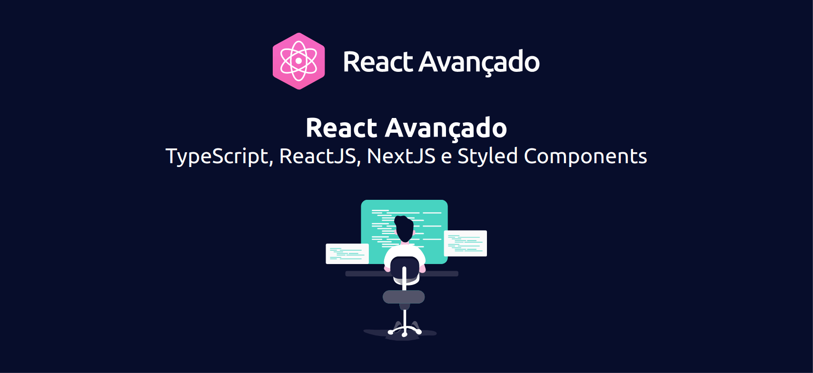

<h1 align="center">
  
</h1>

<h2 align="center">React Avançado</h2>

<p align="center">
  
  
  <a
    href="https://github.com/nicolas-justin/react-avancado-boilerplate/issues">
    
  </a>
  <a
    href="https://github.com/nicolas-justin/react-avancado-boilerplate/pulls">
    
  </a>
  <a
    href="https://github.com/nicolas-justin/react-avancado-boilerplate/commits/master">
    
  </a>
  <a
    href="https://github.com/nicolas-justin/react-avancado-boilerplate/actions?query=workflow%3Aci">
    
  </a>
  <a
    href="LICENSE.md">
    
  </a>
</p>

<p align="center">
  <a href="#project">Projeto</a>
  &nbsp;&nbsp;&nbsp;|&nbsp;&nbsp;&nbsp;
  <a href="#requisites">Requisitos</a>
  &nbsp;&nbsp;&nbsp;|&nbsp;&nbsp;&nbsp;
  <a href="#techs">Tecnologias</a>
  &nbsp;&nbsp;&nbsp;|&nbsp;&nbsp;&nbsp;
  <a href="#clone">Clonando</a>
  &nbsp;&nbsp;&nbsp;|&nbsp;&nbsp;&nbsp;
  <a href="#commands">Comandos</a>
  &nbsp;&nbsp;&nbsp;|&nbsp;&nbsp;&nbsp;
  <a href="#contribute">Contribuindo</a>
  &nbsp;&nbsp;&nbsp;|&nbsp;&nbsp;&nbsp;
  <a href="#license">Licença</a>
</p>

<br>

<p align="center">
  
</p>

<br>

<h1>
  <a id="project"></a>
  📦 Projeto
</h1>

Projeto construído com base no curso de React Avançado do Willian Justen.
Esse boilerplate visa facilitar a construção de novos projetos.

<br>

<h1>
  <a id="requisites"></a>
  📝 Requisitos
</h1>

Para executar esse projeto é necessário ter o **Node.js** e **NPM** ou **Yarn** instalados em seu computador:

- [Node.js](https://nodejs.org/en/)
- [NPM](https://npmjs.com/get-npm)
- [Yarn](https://yarnpkg.com/getting-started)

### Verificar os requisitos

Para verificar se você tem o Node.js instalado, execute este comando em seu terminal:

```bash
node -v
```

Para confirmar que o npm está instalado, você pode executar este comando no seu terminal:

```bash
npm -v
# ou
yarn -v
```

> 📌 **Nota:**
>
> - Se os comandos não forem encontrados, reinicie o terminal.
>
> - Se ainda não funcionar, verifique se o caminho onde o _Node.js_ foi instalado, encontra-se nas variáveis de ambiente do seu sistema operacional, se não estiver, insira-o e reinicie o terminal novamente.
>
> - Em último caso, reinstale o _Node.js_.

<br>

<p align="right">
  <a href="#readme" title="Voltar ao topo">⬆ Voltar ao topo</a>
</p>

<br>

<h1>
  <a id="techs"></a>
  ⚡ Tecnologias
</h1>

Esse projeto foi desenvolvido com as seguintes tecnologias:

- [Node.js](https://nodejs.org)
- [Next.js](https://nextjs.org)
- [ReactJS](https://reactjs.org)
- [TypeScript](https://www.typescriptlang.org/)
- [Styled Components](https://styled-components.com)
- [Jest](https://jestjs.io)
- [React Testing Library](https://testing-library.com/docs/react-testing-library/intro)
- [Storybook](https://storybook.js.org)
- [ESLint](https://eslint.org)
- [Prettier](https://prettier.io)
- [Husky](https://typicode.github.io/husky)
- [Next PWA](https://github.com/shadowwalker/next-pwa)

<br>

<p align="right">
  <a href="#readme" title="Voltar ao topo">⬆ Voltar ao topo</a>
</p>

<br>

<h1>
  <a id="clone"></a>
  📥 Clonando
</h1>


Para iniciar o projeto em seu computador, primeiramente é necessário `clonar` esse repositório.
Para isso, abra o seu terminal, navegue até a pasta onde deseja manter o projeto baixado.
Após, digite o seguinte comando:

```bash
git clone https://github.com/nicolas-justin/react-avancado-boilerplate.git
```

<br>

Feito o download, iniciaremos o projeto.
Navegue até a pasta `react-avancado-boilerplate`:

```bash
cd react-avancado-boilerplate
```

Agora iremos instalar as dependências do projeto, com o seguinte comando:

```bash
npm install
# ou
yarn
```

Após baixado as dependências, iremos iniciar o servidor executando:

```bash
npm start
# ou
yarn start
```

Pronto!

<br>

<p align="right">
  <a href="#readme" title="Voltar ao topo">⬆ Voltar ao topo</a>
</p>

<br>

<h1>
  <a id="commands"></a>
  ⌨️ Comandos
</h1>

- `dev`: executa a aplicação no endereço `localhost:3000`
- `build`: constrói a versão da aplicação otimizada para produção
- `start`: inicia um servidor simples da aplicação com a versão otimizada para produção
- `lint`: executa o Linter em todos as páginas e componentes da aplicação
- `test`: utiliza o Jest para testar todos as páginas e componentes da aplicação
- `test:watch`: executa o Jest em "watch mode"
- `storybook`: executa o Storybook no endereço `localhost:6006`
- `build-storybook`: constrói a versão do Storybook otimizada para produção

<br>

<p align="right">
  <a href="#readme" title="Voltar ao topo">⬆ Voltar ao topo</a>
</p>

<br>

<h1>
  <a id="contribute"></a>
  💡 Contribuindo
</h1>

Siga os passos abaixo para contribuir com a melhoria do projeto:

- Faça um _fork_ desse repositório;
- Crie uma _branch_ com a sua _feature_: `git checkout -b sua-feature`;
- Faça _commit_ das suas alterações: `git commit -m "Feature: Descrição da sua feature."`;
- Faça _push_ para a sua _branch_: `git push origin sua-feature`;

> 📌 **Nota:**
>
> - Após o _merge_ de seu _pull request_, não esqueça de **deletar** a sua _branch_.

<br>

<p align="right">
  <a href="#readme" title="Voltar ao topo">⬆ Voltar ao topo</a>
</p>

<br>

<h1>
  <a id="license"></a>
  📄 Licença
</h1>

Esse projeto encontra-se sob a licença MIT.
Para mais detalhes, consulte o arquivo [LICENSE](LICENSE.md).

<br>

<p align="right">
  <a href="#readme" title="Voltar ao topo">⬆ Voltar ao topo</a>
</p>

---

<br>

<p align="center">
  <a
    href="https://linkedin.com/in/nicolas-justin">
    
  </a>
  &nbsp;&nbsp;&nbsp;&nbsp;&nbsp;&nbsp;
  <a
    href="https://twitter.com/onicolasjustin">
    
  </a>
  &nbsp;&nbsp;&nbsp;&nbsp;&nbsp;&nbsp;
  <a
    href="https://t.me/nicolasjustin">
    
  </a>
</p>

<p align="center">
  Construído com ❤️ por <a href="https://github.com/nicolas-justin">Nícolas Justin</a>
</p>
